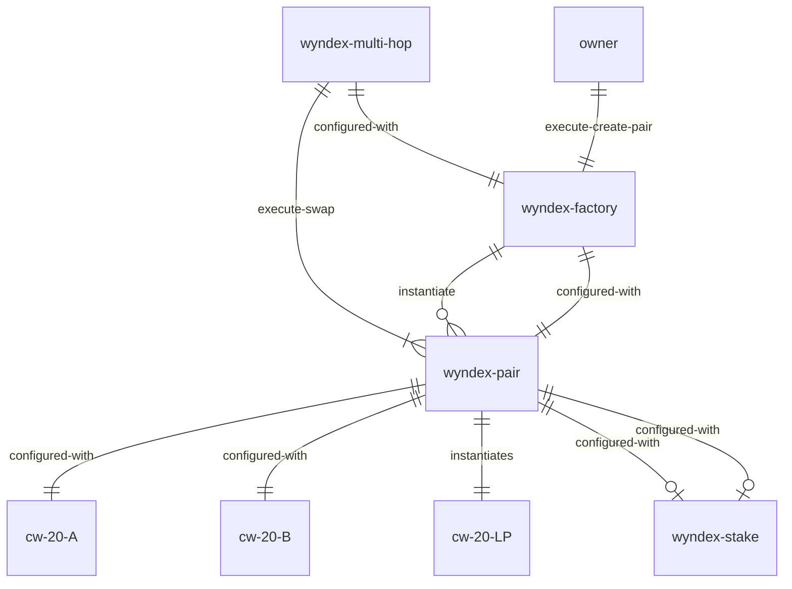

[Wyndex Architecture](wyndex_architecture.pdf)

```mermaid
erDiagram
    wyndex-multi-hop ||--|| wyndex-factory : configured-with
    wyndex-multi-hop ||--|{ wyndex-pair : execute-swap
    wyndex-pair ||--|| cw-20-A : configured-with
    wyndex-pair ||--|| cw-20-B : configured-with
    wyndex-pair ||--|| wyndex-factory : configured-with
    wyndex-factory ||--o{ wyndex-pair  : instantiate
    wyndex-pair ||--|| cw-20-LP : instantiates
    wyndex-pair ||--o| wyndex-stake : configured-with
    wyndex-pair ||--o| wyndex-stake : configured-with
    owner ||--|| wyndex-factory : execute-create-pair
```